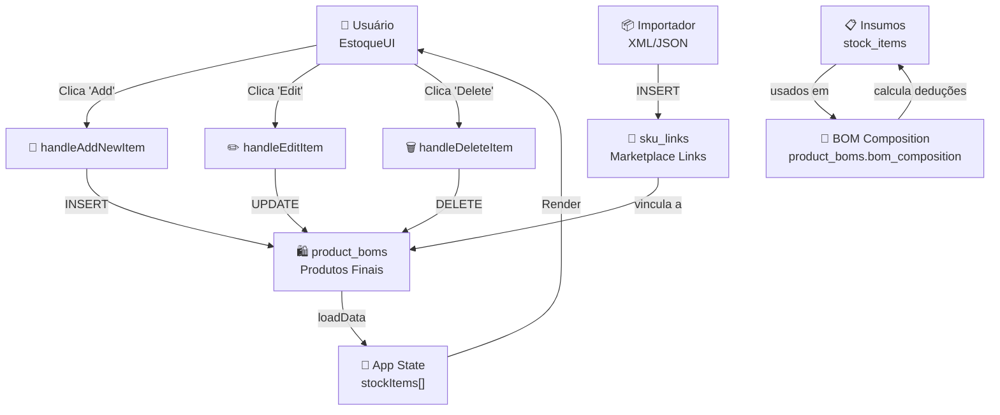

# 🏗️ DIAGRAMA DE ARQUITETURA DO ESTOQUE

## 📊 Fluxo de Dados Geral



---

## 🗂️ Estrutura de Tabelas

```
┌─────────────────────────────────────────┐
│         BANCO DE DADOS ESTOQUE          │
└─────────────────────────────────────────┘

┌──────────────────────────────────────────┐
│         product_boms                     │  ← PRODUTOS FINAIS
├──────────────────────────────────────────┤
│ • id (prod_001...)                       │
│ • code (PROD-001)                        │
│ • name (Cartaz A3)                       │
│ • kind = 'PRODUTO'                       │
│ • current_qty, reserved_qty, ready_qty   │
│ • price, cost                            │
│ • bom_composition (JSONB)  ────┐         │
│ • category, unit, status      │         │
│ • created_at, created_by_id   │         │
│ • bling_fields (JSON)         │         │
│ • 70 colunas total            │         │
└──────────────────────────────────────────┘
                                 │
        ┌────────────────────────┘
        │
        ▼
┌──────────────────────────────────────────┐
│         stock_items                      │  ← INSUMOS/MATÉRIAS
├──────────────────────────────────────────┤
│ • id (mat_001...)                        │
│ • code (MAT-001)                         │
│ • name (Papel A4)                        │
│ • kind = 'INSUMO'  (CONSTRAINT)          │
│ • current_qty, reserved_qty              │
│ • unit (kg, m2, litros, etc)             │
│ • category, description                  │
│ • created_at, created_by_id              │
│ • 25 colunas total                       │
└──────────────────────────────────────────┘

┌──────────────────────────────────────────┐
│         sku_links                        │  ← VÍNCULOS MARKETPLACE
├──────────────────────────────────────────┤
│ • imported_sku (ML-12345...) PK          │
│ • master_product_sku (PROD-001)          │
│ • product_code (PROD-001)                │
│ • imported_at, matched_at                │
│ • 4 colunas total                        │
└──────────────────────────────────────────┘
        │
        ├───────────► product_boms
        │
        └───────────► stock_items

┌──────────────────────────────────────────┐
│         Tabelas de Suporte               │
├──────────────────────────────────────────┤
│ • stock_movements (histórico deduções)   │
│ • estoque_pronto (cálculo pronto envio)  │
│ • stock_reservations (reservas)          │
│ • order_items (pedidos processados)      │
│ • orders, orders_details                 │
│ • nfes, certificados, stock_pack_groups  │
└──────────────────────────────────────────┘
```

---

## 🔄 Fluxo de Operação: Criar Produto

```
┌─────────────────┐
│  UI: Click ADV  │  (Adicionar Novo Produto)
└────────┬────────┘
         │
         ▼
┌────────────────────────────────────┐
│  handleAddNewItem(                 │
│    name: "Cartaz A3",              │
│    code: "PROD-001",               │
│    unit: "unidades"                │
│  )                                 │
└────────┬────────────────────────────┘
         │
         ▼
┌────────────────────────────────────┐
│  dbClient.from(                    │
│    'product_boms'                  │
│  ).insert({                        │
│    id: 'prod_...',                 │
│    code, name, unit,               │
│    kind: 'PRODUTO',                │
│    current_qty: 0,                 │
│    created_at: NOW(),              │
│    created_by_id: user.id          │
│  })                                │
└────────┬────────────────────────────┘
         │
         ▼
┌────────────────────────────────────┐
│  Banco: INSERT em product_boms     │
│  Status: OK                        │
└────────┬────────────────────────────┘
         │
         ▼
┌────────────────────────────────────┐
│  loadData() [recarrega do banco]   │
│  Query: SELECT * FROM product_boms │
└────────┬────────────────────────────┘
         │
         ▼
┌────────────────────────────────────┐
│  let dataMap.stockItems = [        │
│    {                               │
│      id: 'prod_...',               │
│      code: 'PROD-001',             │
│      name: 'Cartaz A3',            │
│      kind: 'PRODUTO',              │
│      current_qty: 0                │
│    }                               │
│  ]                                 │
└────────┬────────────────────────────┘
         │
         ▼
┌────────────────────────────────────┐
│  Validação:                        │
│  ✓ Array?      Sim                 │
│  ✓ Não vazio?  Sim (1 item)        │
│  ✓ Itens OK?   Sim                 │
└────────┬────────────────────────────┘
         │
         ▼
┌────────────────────────────────────┐
│  setStockItems(mappedStockItems)   │
│  Estado atualizado com novo item   │
└────────┬────────────────────────────┘
         │
         ▼
┌────────────────────────────────────┐
│  Re-render da UI                   │
│  "Cartaz A3" aparece na lista      │
└────────┬────────────────────────────┘
         │
         ▼
┌─────────────────┐
│  ✅ SUCCESS!    │
└─────────────────┘
```

---

## 🔗 Fluxo: Vincular SKU ao Produto

```
┌──────────────────────────────────────┐
│  Importar XML do Marketplace         │
│  SKU: ML-12345678901                │
│  Vendedor: Loja Exemplo              │
└──────────────┬───────────────────────┘
               │
               ▼
┌──────────────────────────────────────┐
│  User: "Vincular a qual produto?"    │
│  Opções: [Cartaz A3 ▼]              │
└──────────────┬───────────────────────┘
               │
               ▼
┌──────────────────────────────────────┐
│  handleLinkSku(                      │
│    importedSku: "ML-12345...",       │
│    productCode: "PROD-001"           │
│  )                                   │
└──────────────┬───────────────────────┘
               │
               ▼
┌──────────────────────────────────────┐
│  INSERT INTO sku_links (             │
│    imported_sku,                     │
│    master_product_sku,               │
│    product_code,                     │
│    matched_at: NOW()                 │
│  )                                   │
└──────────────┬───────────────────────┘
               │
               ▼
┌──────────────────────────────────────┐
│  Banco: sku_link criado              │
│  Status: OK                          │
└──────────────┬───────────────────────┘
               │
               ▼
┌──────────────────────────────────────┐
│  UI: "SKU linkado com sucesso!"      │
│  product_boms.id now linked to SKU   │
└──────────────┬───────────────────────┘
               │
               ▼
┌─────────────────┐
│  ✅ VINCULADO!  │
└─────────────────┘

RESULTADO: Quando SKU vender, app saberá que é "Cartaz A3"
```

---

## 📐 Fluxo: Definir Composição de BOM

```
┌────────────────────────────────┐
│  Editar: Cartaz A3             │
│  Clicar: "Definir BOM"         │
└──────────┬──────────────────────┘
           │
           ▼
┌────────────────────────────────────┐
│  Modal: Selecionador de Insumos    │
│                                    │
│  ☐ Papel A4 (100 resmas) qty: [1]│
│  ☐ Tinta Preta (50 l) qty: [0.1]│
│  ☐ Cola PVA (25 kg) qty: [0.05]│
│  ☐ Laminado (200 m2) qty: [0.1]│
│                                    │
│  [Salvar BOM]                      │
└──────────┬──────────────────────────┘
           │
           ▼
┌────────────────────────────────────┐
│  UPDATE product_boms SET           │
│    bom_composition = {             │
│      items: [                       │
│        {                            │
│          insumo_code: "MAT-001",   │
│          insumo_name: "Papel A4",  │
│          quantity: 1,               │
│          unit: "resmas"             │
│        },                           │
│        {                            │
│          insumo_code: "MAT-002",   │
│          insumo_name: "Tinta",     │
│          quantity: 0.1,             │
│          unit: "litros"             │
│        }                            │
│      ]                              │
│    }                               │
│  WHERE id = "prod_001"             │
└──────────┬──────────────────────────┘
           │
           ▼
┌────────────────────────────────────┐
│  Banco: BOM definido               │
│  Status: OK                        │
└──────────┬──────────────────────────┘
           │
           ▼
┌────────────────────────────────────┐
│  UI: "BOM salvo!"                  │
│  product_boms.bom_composition agora│
│  tem estrutura completa            │
└──────────┬──────────────────────────┘
           │
           ▼
┌──────────────────────────────────────┐
│  ✅ PRONTO PARA DEDUÇÕES!            │
│  Quando Cartaz diminui, pode         │
│  deduzir insumos automaticamente     │
└──────────────────────────────────────┘
```

---

## 🔊 Fluxo Automático: Stock Deduction (triggers)

```
Quando: user muda Cartaz de 50 → 40 un

┌────────────────────────────────┐
│  UPDATE product_boms SET       │
│    current_qty = 40            │
│  WHERE id = "prod_001"         │
└──────────┬─────────────────────┘
           │
           ▼ (Trigger disparado!)
┌────────────────────────────────┐
│  TRIGGER:                      │
│  For each changed product_bom: │
│    Get bom_composition         │
│    For each insumo in BOM:     │
│      qty_reduced = 10 × qty    │
│      UPDATE stock_items SET    │
│        current_qty -= qty_red  │
└──────────┬─────────────────────┘
           │
           ▼
┌────────────────────────────────┐
│  UPDATE stock_items SET        │
│    current_qty = 90            │ (era 100)
│  WHERE code = "MAT-001"        │
│  Quantidade deduzida: 1×10=10  │
└──────────┬─────────────────────┘
           │
           ▼
┌────────────────────────────────┐
│  ✅ AUTOMÁTICO!                │
│  Papel: 100 → 90 resmas        │
│  Tinta: 50 → 49 litros         │
│  Etc...                        │
└────────────────────────────────┘
```

---

## 📋 Estado da Aplicação React

```typescript
App State (após loadData):

{
  // ====== ESTOQUE ======
  stockItems: [  // ← product_boms
    {
      id: "prod_001",
      code: "PROD-001",
      name: "Cartaz A3",
      kind: "PRODUTO",
      current_qty: 50,
      reserved_qty: 10,
      ready_qty: 40,
      category: "Impressos",
      unit: "unidades"
    },
    ...
  ],

  stockMovements: [  // ← histórico de mudanças
    {
      id: "...",
      stockItemCode: "PROD-001",
      origin: "manual_adjustment",
      qty_delta: -10,
      createdAt: "2024-...",
      createdBy: "User Name"
    },
    ...
  ],

  skuLinks: [  // ← vínculos marketplace
    {
      importedSku: "ML-12345...",
      masterProductSku: "PROD-001"
    },
    ...
  ],

  // ====== PRODUÇÃO ======
  weighingBatches: [...],
  grindingBatches: [...],
  productionPlans: [...],
  
  // ====== USUÁRIOS/CONFIGS ======
  users: [...],
  generalSettings: {...},
  adminNotices: [...]
}
```

---

## ✅ Checklist: Sistema Funciona Quando...

- [ ] Executou `MIGRATION_FINAL_UPDATED.sql`
- [ ] Executou `SETUP_DATABASE.sql`
- [ ] App carrega e mostra 3+ produtos na aba Estoque
- [ ] Consegue adicionar novo produto (aparece na lista)
- [ ] Consegue editar produto (nome + qty atualiza)
- [ ] Consegue deletar produto (desaparece da lista)
- [ ] Console mostra logs com ✅ em verde
- [ ] Nenhum erro de "kind column" ou "not found"

---

**Quando tudo estiver verde, você tem um sistema de Estoque TOTALMENTE FUNCIONAL!** 🎉
